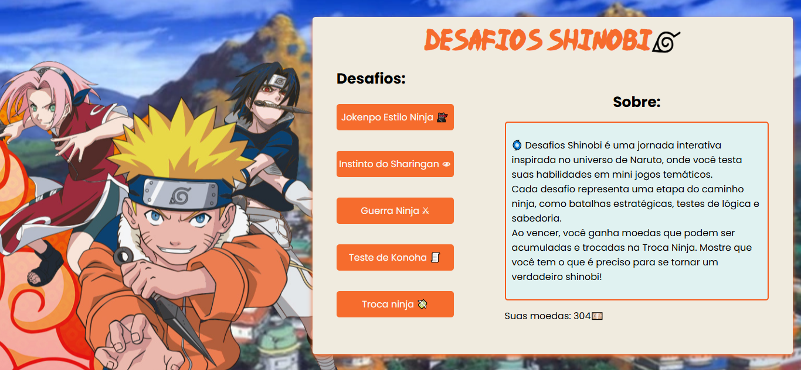
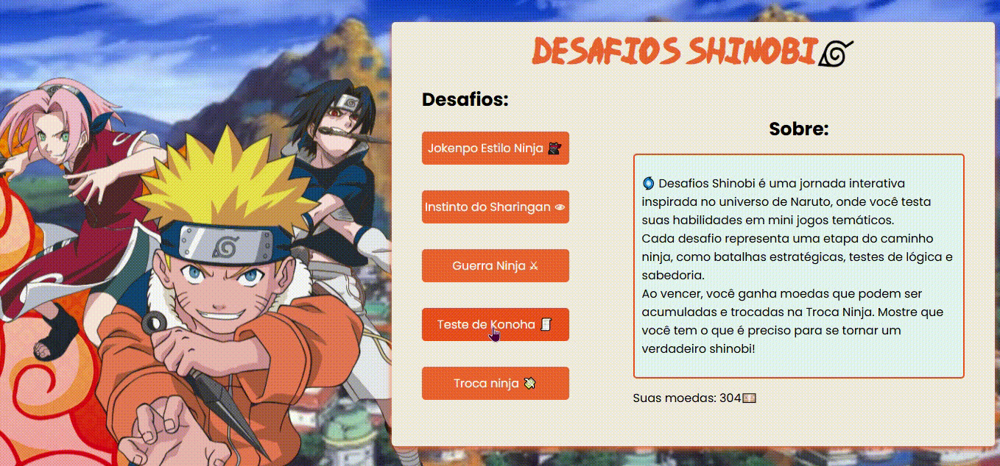
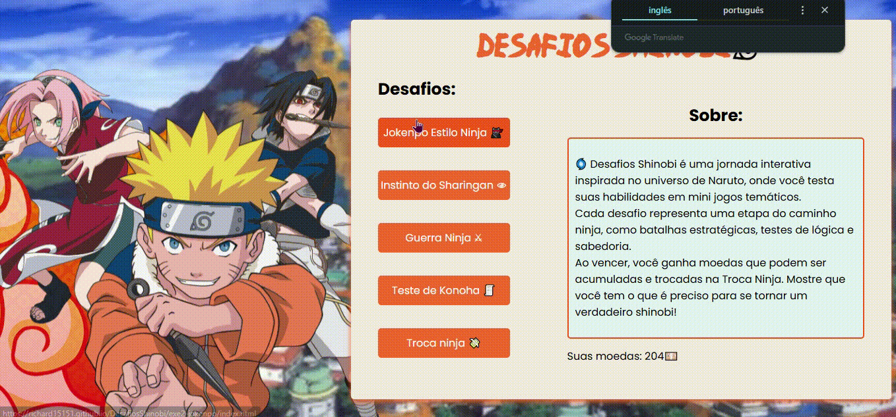
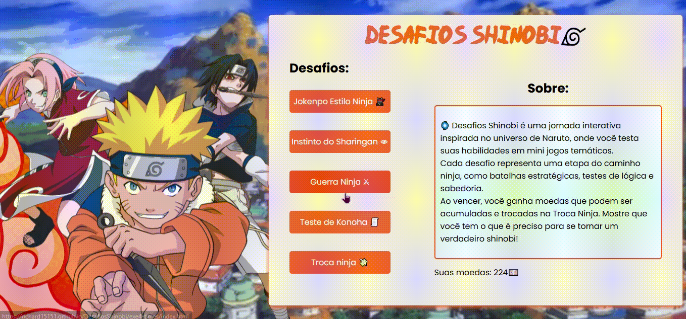

### Imersão dev Alura 👨‍💻

# DESAFIOS SHINOBI

**Descrição:**
Desafios Shinobi é um conjunto de mini-jogos interativos inspirados no universo de Naruto, desenvolvidos durante a Imersão Dev da Alura com foco em JavaScript. O projeto conta com cinco jogos temáticos, onde os jogadores acumulam moedas ninja como recompensa, podendo convertê-las em diferentes moedas (R$, USD e Yen) no conversor. Uma jornada divertida e desafiadora para qualquer fã da Vila da Folha!

## Índice
* [Funcionalidades](#funcionalidades)
* [Tecnologias](#tecnologias-utilizadas)
* [Deploy](#deploy)
* [Autor](#autor)
* [Licença](#licença)

## Funcionalidades
- Tela inicial com moeda acumulada do jogador

- Sistema de recompensa com moedas ganhas nos jogos
- Conversor de moedas ninja para real, dólar e yen
- Jogos temáticos:
  - **Troca Ninja** (moedas ninja para R$, USD e ¥)
  
  - **Jokenpô Estilo Ninja** (Pedra, Kunai ou Pergaminho)
  
  - **Instinto do Sharingan** (inspirado em Round 6 com tema Naruto)
  
  - **Guerra ninja** (monte seu time)
    
  - **Teste de Konoha** (quiz sobre o mundo ninja)
    

## Tecnologias Utilizadas

## Deploy
🔗 desafios-shinobi.vercel.app

## Autor
- Richard – [GitHub](https://github.com/Richard15151) – richard.oliveira.senai@gmail.com

## Licença
Este projeto está licenciado sob a Licença MIT - veja o arquivo LICENSE para mais detalhes.
